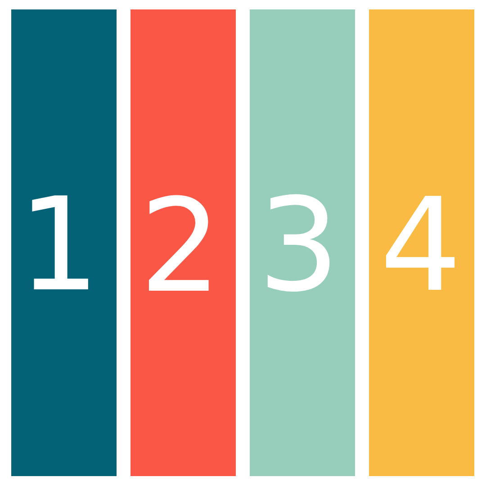

<p align="center">
  
</p>

<h1 align="center">glazeid</h1>

<p align="center">A minimal, extremely efficient workspace bar for <a href="https://github.com/glzr-io/glazewm">GlazeWM</a>.</p>

<p align="center">Shows the active workspace and all available workspaces. Nothing else.</p>

## Features

- One bar per monitor, anchored to any screen edge
- Active workspace highlighted with a filled pill
- Connects to GlazeWM over WebSocket and reacts to workspace events in real time
- Reconnects automatically if GlazeWM restarts
- Pure Rust — no WebView, no JS runtime, no system font dependency
- Transparent window background support on both Windows and macOS
- ~3 MB release binary (LTO + stripped)

## Requirements

- [GlazeWM](https://github.com/glzr-io/glazewm) running on the same machine
- Windows or macOS

## Installation

```sh
cargo install glazeid
```

Or from source:

```sh
cargo install --path .
```

## Usage

Start glazeid after GlazeWM is running:

```sh
glazeid
```

glazeid connects to GlazeWM on `127.0.0.1:6123` and creates a bar on each monitor. It reconnects automatically if the connection drops.

Set `RUST_LOG=debug` for verbose output:

```sh
RUST_LOG=debug glazeid
```

## Configuration

glazeid looks for a config file at:

| Platform | Path |
|----------|------|
| macOS    | `~/.config/.glzr/glazeid/config.yaml` |
| Windows  | `%USERPROFILE%\.glzr\glazeid\config.yaml` |

If the file does not exist, glazeid starts with the built-in defaults. No error is thrown for a missing file — only for a file that exists but cannot be parsed.

A ready-to-use sample config with all options and their defaults is provided at [`resources/config.sample.yaml`](resources/config.sample.yaml). Copy it to the path above and edit as needed.

### All options

```yaml
# Which screen edge the bar docks to.
# Values: "top" | "bottom"
position: "bottom"

# How far along the edge to place the bar, as a percentage of monitor width.
# 0.0 = left-most (default), 50.0 = centred, 100.0 = right edge.
offset_percent: 0.0

# GlazeWM WebSocket IPC port.
glazewm_port: 6123

# Milliseconds to wait before retrying a failed IPC connection.
reconnect_delay_ms: 2000

# Bar background color. Use "#rrggbbaa" for transparency, e.g. "#00000000" = fully transparent.
background: "#00000000"

# Text color for inactive workspace labels.
foreground: "#ffffff"

# Fill color of the active workspace pill.
active_bg: "#DA3B01"

# Text color on the active workspace pill.
active_fg: "#000000"

# Font size in logical pixels.
font_size: 13.0

# Horizontal padding inside each workspace label, in logical pixels.
label_padding_x: 10.0

# Vertical padding above and below the text, in logical pixels.
# Total bar height = font cap-height + 2 × label_padding_y.
label_padding_y: 4.0

# Corner radius of the active workspace pill, in logical pixels.
pill_radius: 4.0
```

Colors are hex strings: `"#rrggbb"` (fully opaque) or `"#rrggbbaa"` (with alpha).

## How it works

| Layer | Technology |
|-------|------------|
| OS window | `winit` — one decoration-free, always-on-top window per monitor |
| Rendering (Windows) | `softbuffer` — CPU framebuffer, no GPU required |
| Rendering (macOS) | Custom `CGImage` surface with premultiplied alpha for true transparency |
| Drawing | `tiny_skia` — fills background, draws rounded-rect pills |
| Text | `fontdue` — rasterizes the embedded JetBrains Mono TTF |
| IPC | `tokio-tungstenite` — WebSocket client to GlazeWM on port 6123 |
| State | `tokio::sync::watch` — IPC task pushes updates; bar redraws only on change |

## License

Apache 2.0 — see [LICENSE](LICENSE).
