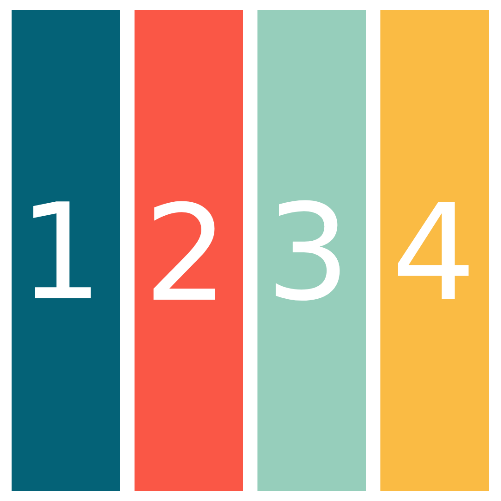

<p align="center">
  
</p>

<h1 align="center">glazeid</h1>

<p align="center">A minimal, extremely efficient workspace widget for <a href="https://github.com/glzr-io/glazewm">GlazeWM</a> that lives inside the Windows taskbar.</p>

<p align="center">Shows the active workspace and all available workspaces. Nothing else.</p>

## Features

- Renders *inside* the native taskbar — one widget per monitor's taskbar
- Active workspace highlighted with a filled pill
- Click a pill to focus that workspace
- Per-pixel alpha over the taskbar; transparent areas stay click-through
- Colors can follow the Windows light/dark theme, switched live
- Connects to GlazeWM over WebSocket and reacts to workspace events in real time
- Reconnects automatically if GlazeWM restarts; re-embeds automatically if Explorer restarts
- No polling: fullscreen apps, auto-hide and z-order are handled by the shell itself
- Pure Rust — no WebView, no JS runtime, no system font dependency
- ~2 MB release binary (LTO + stripped)

## Requirements

- [GlazeWM](https://github.com/glzr-io/glazewm) running on the same machine
- Windows 10 or 11

> glazeid 0.8+ is Windows-only. The last release with macOS support (as an
> overlay bar) is v0.7.0 — `cargo install glazeid --version 0.7.0`. Its source
> lives on the `backup/v0.7.0-overlay` branch.

## Installation

```sh
cargo install glazeid
```

Or from source:

```sh
cargo install --path .
```

## Usage

Start glazeid after GlazeWM is running:

```sh
glazeid
```

glazeid connects to GlazeWM on `127.0.0.1:6123` and embeds a widget into the
taskbar of every monitor that has one (the primary taskbar, plus secondary
taskbars when "show my taskbar on all displays" is enabled). It reconnects
automatically if the connection drops.

Quit via the tray icon menu.

Set `RUST_LOG=debug` for verbose output:

```sh
RUST_LOG=debug glazeid
```

## Configuration

glazeid looks for a config file at:

```
%USERPROFILE%\.glzr\glazeid\config.yaml
```

If the file does not exist — or is empty — glazeid starts with the built-in
defaults. An error is thrown only for a file that exists but cannot be parsed.
Unknown keys (e.g. options from glazeid 0.7.x such as `position`) are ignored,
so an old config keeps working.

A ready-to-use sample config with all options and their defaults is provided
at [`resources/config.sample.yaml`](resources/config.sample.yaml). Copy it to
the path above and edit as needed.

### All options

```yaml
# How far along the taskbar to place the widget, as a percentage of the
# taskbar's width. 0.0 = left edge (default), 50.0 = centred, 100.0 = flush
# with the right edge. Clamped so the widget always stays fully on the
# taskbar. The widget is always centred vertically inside the taskbar.
offset_percent: 0.0

# GlazeWM WebSocket IPC port.
glazewm_port: 6123

# Milliseconds to wait before retrying a failed IPC connection.
reconnect_delay_ms: 2000

# Colors accept either a single value used for both Windows themes:
#   foreground: "#ffffff"
# or per-theme values, switched live with the Windows system (taskbar) theme:
#   foreground: { light: "#000000", dark: "#ffffff" }

# Widget background color. Use "#rrggbbaa" for transparency.
# The default is fully transparent, so only the workspace pills are visible.
background: "#00000000"

# Text color for inactive workspace labels.
foreground:
  light: "#000000"
  dark: "#ffffff"

# Fill color of the active workspace pill.
active_bg: "#DA3B01"

# Text color on the active workspace pill.
active_fg:
  light: "#ffffff"
  dark: "#000000"

# Font size in logical pixels.
font_size: 13.0

# Horizontal padding inside each workspace label, in logical pixels.
label_padding_x: 10.0

# Vertical padding above and below the text, in logical pixels.
# Total widget height = font cap-height + 2 × label_padding_y.
label_padding_y: 4.0

# Corner radius of the active workspace pill, in logical pixels.
pill_radius: 4.0

# Hide the system tray icon. When hidden, quit glazeid by killing the
# process: taskkill /IM glazeid.exe /F
trayicon_hidden: false
```

Colors are hex strings: `"#rrggbb"` (fully opaque) or `"#rrggbbaa"` (with
alpha). The light/dark switch follows the Windows *system* theme (the one the
taskbar uses) and reacts immediately when it changes — no restart needed.

## How it works

| Layer | Technology |
|-------|------------|
| Window | Raw Win32 layered child window, embedded via `SetParent` into `Shell_TrayWnd` / `Shell_SecondaryTrayWnd` |
| Drawing | `tiny_skia` — fills background, draws rounded-rect pills |
| Text | `fontdue` — rasterizes the embedded JetBrains Mono TTF |
| Presentation | 32-bpp premultiplied DIB section + `UpdateLayeredWindow` (per-pixel alpha) |
| IPC | `tokio-tungstenite` — WebSocket client to GlazeWM on port 6123 |
| State | `tokio::sync::watch` + `PostMessage` — the IPC task wakes the Win32 message loop only on change |
| Explorer restarts | `TaskbarCreated` broadcast → widgets are re-embedded |

Because the widget is a child window of the taskbar itself, the shell handles
everything the old overlay implementation (v0.7.x) had to fight for by hand:
no topmost z-order battles, no fullscreen detection, no 1-second polling tick.
When the taskbar hides, moves or dies, the widget follows it.

Input is alpha-based: pixels with alpha 0 pass clicks straight through to the
taskbar, while pill pixels receive them — a click sends
`focus --workspace <name>` over the existing WebSocket connection. The widget
never activates, so clicks never steal keyboard focus. Theme changes arrive
via the `WM_SETTINGCHANGE` broadcast (one registry read, no polling).

## License

Apache 2.0 — see [LICENSE](LICENSE).
